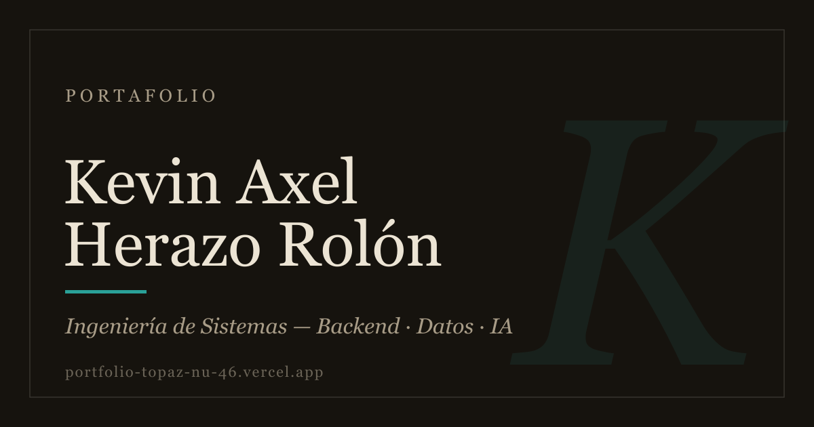

<div align="center">
  

  <h1>Portafolio · Kevin Axel Herazo Rolón</h1>

  <p>Mi portafolio personal: cinco secciones que se recorren con scroll.</p>

  <p>
    
    
    
  </p>

  <p><strong>🔗 <a href="https://portfolio-topaz-nu-46.vercel.app">Ver en vivo</a></strong></p>
</div>

---

Un recorrido de portada, mis proyectos, mi stack, mis gustos personales (cine, juegos, libros y música) y contacto. Con tema claro y oscuro, tipografía clásica y formulario de contacto integrado.

## Ejecutarlo

```bash
npm install
npm run dev
```
